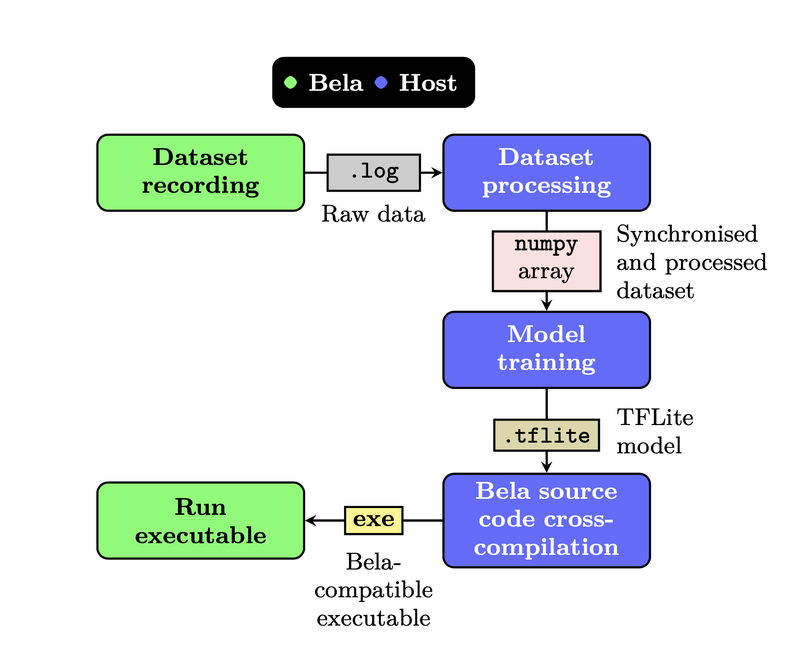

# A pipeline for recording datasets and running neural networks in Bela

**Note: An updated version of this pipeline using pytorch and [pybela](https://github.com/belaplatform/pybela) can be found here: https://github.com/pelinski/pybela-pytorch-xc-tutorial**

We present a pipeline to record a dataset of signals, export a light model trained on those signals, and run the model in real-time on Bela. An overview of the pipeline is given in the figure below - it should be noted the pipeline relies on using a host machine for dataset processing, training and exporting a light model, and cross-compiling the inference code.
In the pipeline’s first stage, a dataset of sensor signals can be recorded in a single or, in case more channels than available in a single board are needed, in multiple Bela boards. The raw data files are then transferred into the host machine for the data processing step, where the signals recorded on different boards are aligned sample-wise, and the dataset is converted into a numpy array, which can be loaded into deep learning frameworks such as Tensorflow or PyTorch. After the model is trained on the dataset, it must be exported as a `.tflite` file, since the Bela inference code is based on the TFLite C++ library. Finally, the inference code is cross-compiled and transferred into the Bela, where it can be executed.

<center>

</center>

## Usage

Clone the repo into your host machine (laptop):

```
git clone --recurse-submodules https://github.com/pelinski/bela-dl-pipeline
```

The instructions for each step are inside of their respective folders.

## Citation

This work was presented at the NIME 2023 conference:

```
Pelinski, T., Díaz, R., Benito Temprano, A. L., & McPherson, A. (2023). Pipeline for recording datasets and running neural networks on the Bela embedded hardware platform. Proceedings of the International Conference on New Interfaces for Musical Expression. NIME 2023, Mexico City, Mexico.
```

The paper can be found [here](https://arxiv.org/pdf/2306.11389.pdf).
